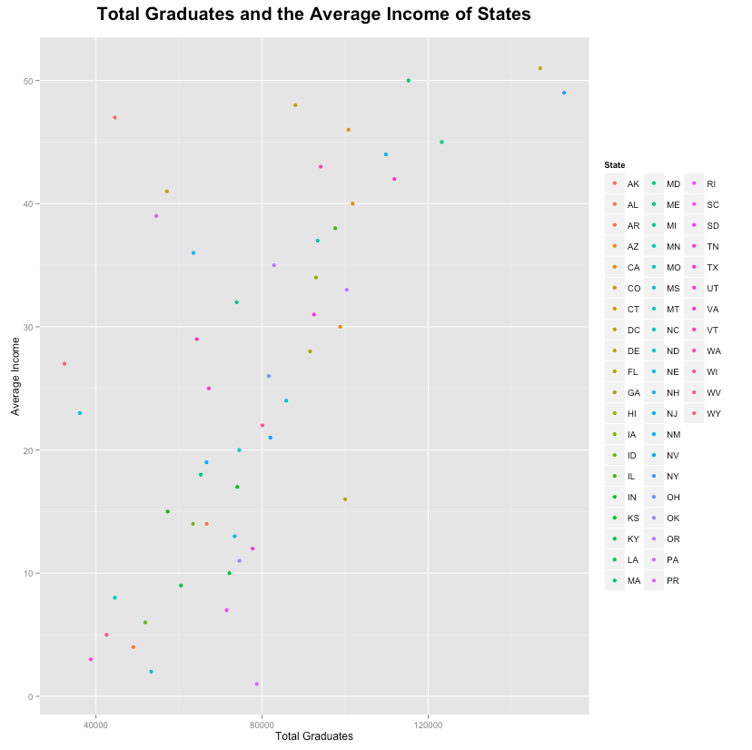
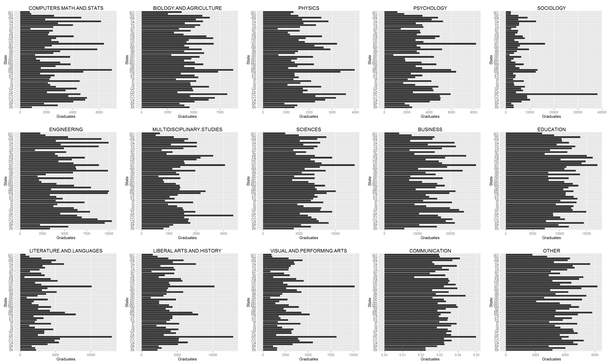

```{r, echo=FALSE}
source('../00 Doc/.RProfile')
```

###Importing the Dataframe


#####First, import the .csv file into SQL. 
Click the (+) to access the dropdown file system of the connection in which you would like to import the data.Right click the __Tables__ folder and select the __Import Data__ selection.


Find the .csv file you want to work with and select it for import.


Run through the Data Import Wizard, giving the table a name and identifying the types that each column represent.


Once you are finished with this, the data has been stored in the database.


In our particular case, the data has been stored on a cloud-based database. An SQL query will be used to extract the dataframe from the database for access during the project. The following example query was used:

```
df <- data.frame(fromJSON(getURL(URLencode('129.152.144.84:5001/rest/native/?query="select * from DATAFRAME"'),httpheader=c(DB='jdbc:oracle:thin:@129.152.144.84:1521:ORCL', USER='C##cs329e_UTEid', PASS='orcl_UTEid', MODE='native_mode', MODEL='model', returnDimensions = 'False', returnFor = 'JSONLITE'), verbose = TRUE)))
```

***
##Datasets

###Distribution of Undergraduate Majors

This dataset presents the first major of degree achieved by people that are 25 years and older. Data is distributed according to geographical ID. This ID information is translated in a later table.

```{r}
source("../01 Data/Majors dataset.R")
tbl_df(mdf)
```

###Geographical ID with States

This dataset presents the geographical ID and correlates it to the state in which that ID is.

```{r}
source("../01 Data/States dataset.R")
tbl_df(sdf)
```

###Average Income of States

This dataset presents the average and median income of each state. 
```{r}
source("../01 Data/Income dataset.R")
tbl_df(idf)
```
***
## Dataframes

###Dataframe 1: Inner Join of the Majors and States 

The two datasets of undergraduate majors and states are joined in SQL by using the geographical ID column. The resulting dataset gives the percentages of each major for every state in the U.S. 
```{r}
source("../01 Data/Majors Percentage INNER JOINED dataset.R")
tbl_df(mjdf)
```

###Dataframe 2: Left Join of Income and Graduates 

A Graduate table was constructed in SQL prior to this join. Then a second SQL query was run to join the Graduates table to the Income table through state to represent the total graduates and annual income for each state. 
``` {r}
source("../01 Data/Graduates OUTER JOINED dataset.R")
tbl_df(sigdf)
```

###Dataframe 3: Right Join of Majors and States

The majors and states datasets are joined using geogrphical ID again but gives total graduates instead of percentages.

``` {r}
source("../01 Data/Majors Totals RIGHT JOINED dataset.R")
tbl_df(ddf)
```

***
##Data Wrangling 
Three data wrangling sets were constructed using %>% on the joined datasets. 

###Distribution of Degrees for Each State
First, dataframe 1 is piped through a group by statement to sort by state followed by a summarization to generate a single mean value for each degree. The number is normalized to a percentage so that each state had a distribution of degrees. The data was then reformatted to fit the "tidy" specifications. To generate a single png for all the states, a for loop was utilized in conjunction with the png function through a list to populate a single png.


Based on the data, education and business first bachelor degrees are prominent in a majority of the states and that states have a varying distribution of degrees based on its society and employment. In the case of DC, the higher percentage of sociology degrees have a correlation with the greater amount of politicians concentrated in the area. 

###Average Income vs Total Graduates by State
Next, dataframe 2 is grouped by state and subsequently summarised to generate the total amount of graduates and average income for each state. The dataframe is then run through ggplot to generate a scatterplot that is color coded by state.



From this scatterplot, a direct linear relationship can be seen between number of graduates and average income. As the total number of graduates with bachelor's degrees increases, there is a similar increase in the average income. 

###Total Graduate Distribution by State of Degrees
Finally, dataframe 3 is piped through a group by statement to sort by state followed by a summarization to generate a single total value for each degree. The data was then reformatted to fit the "tidy" specifications. To generate a single png for all the degrees, a for loop was utilized in conjunction with the png function through a list to populate a single png.



Similar to the first data wrangle, this visualization shows instead, the total graduates rather than a percentage of each degree in every state. For each degree, we can see the distribution of that degree across all states. 